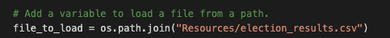
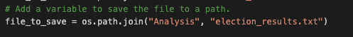

# Election Audit
This election audit calculated and reported the US Congressional Precinct in Colorado election results to be submited to the election commission. 

## Election Audit Results
Here are the election audit results: 

### Total Votes
- 369,711 votes were cast in this congresional election

### County Votes
- 38,855 votes were cast in Jefferson, representing 10.5% of total votes
- 306,055 votes were cast in Denver, representing 82.8% of total votes
- 24,801 votes were cast in Arapahoe, representing 6.7% of total votes 

### Largest County Turnout
- Denver was the county with the largest number of votes

### Candidate Votes
- Charles Casper received 85,213 votes, representing 23.0% of total votes
- Diana DeGette received 272,892 votes, representing 73.8% of total votes
- Raymon Anthony Doane received 11,606 votes, representing 3.1% of total votes 

### Election Winner
- Diana DeGette won the election with a total of 272,892 votes, representing 73.8% of total votes 

## Proposal
The script used to calculate the results of this election can be used — with some modifications — for any election. Here's how the script should be modified: 

### Change File To Load
The path to the .csv file that holds the raw election data will need to change to support new election data. 

### Change File To Save
The path to the .txt file that is used to write the election results will need to change to support new election results. 

